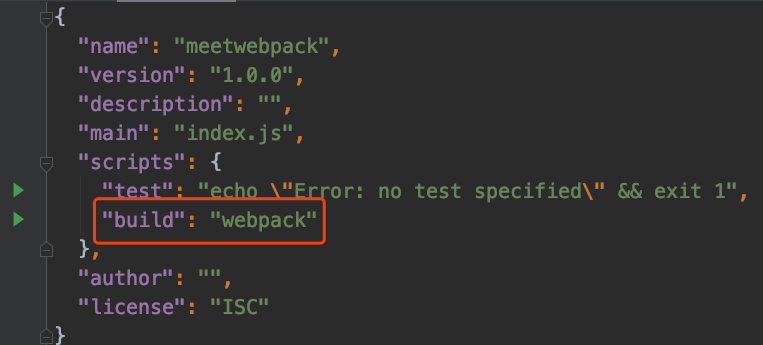

# 一、Mac下安装webpack

`系统macOS10.14.6`

首先需要安装`node`，在安装完成之后，`npm`就附加的安装上了

接下来就可以安装`webpack`

ps：我安装的是3.6.0版本，且这里的安装为[全局安装]

```shell
npm install webpack@3.6.0 -g
```

在mac系统下出现了如下问题

```shell
npm ERR! The operation was rejected by your operating system.
npm ERR! It is likely you do not have the permissions to access this file as the current user
```

可以知道这是因为我们没有权限对这个文件夹进行操作，因此，我们就需要更改权限。

```shell
sudo chown -R 用户名 文件名
例如：sudo chown -R yanjundong /usr/local/lib/node_modules
```

重新安装，就可以成功。


# 二、webpack的使用

## 1、webpack的起步

首先有如下的`mathUtils.js`

```javascript
function add(num1, num2) {
  return num1 + num2
}
function mul(num1, num2) {
  return num1 * num2;
}
module.exports = {
  add,
  mul
}
```

引用：在`main.js`中引入`mathUtils.js`暴露出来的函数；

```js
const {add, mul} = require('./mathUtils')

console.log(add(10, 20));
console.log(mul(20, 50));
```

在terminal中使用webpack打包，目标文件为dist/bundle.js

```shell
webpack ./src/main.js ./dist/bundle.js
```


在`index.html`中引用`bundle.js`即可，而不需要引用`main.js`和`mathUtils.js`

```html
<!DOCTYPE html>
<html lang="en">
<head>
  <meta charset="UTF-8">
  <title>Title</title>
</head>
<body>
<script src="./dist/bundle.js"></script>
</body>
</html>
```

## 2、入口起点(entry points)

**入口起点(entry point)**指示 webpack 应该使用哪个模块，来作为构建其内部*依赖图*的开始。

可以通过在 webpack 配置中配置 `entry` 属性，来指定一个入口起点（或多个入口起点）

entry配置最简单的例子：

```js
module.exports = {
  entry: './path/to/my/entry/file.js'
};
```

## 3、输出(output)

可以控制`webpack`如何向硬盘写入打包后的文件，输出配置`output`只能有一个。

### 用法(usage)

在` webpack` 中配置 `output` 属性的最低要求是，将它的值设置为一个对象，包括以下两点：

- `filename` 用于输出文件的文件名。
- 目标输出目录 `path` 的绝对路径。

**webpack.config.js**

```js
const config = {
  output: {
    filename: 'bundle.js',
    path: './dist'
  }
};

module.exports = config;
```

此配置将一个单独的 `bundle.js` 文件输出到 `./dist` 目录中。

## 4、loader

*loader* 让 webpack 能够去处理那些非 JavaScript 文件（webpack 自身只理解 JavaScript）

[加载css、图片，也包括将ES6转化为ES5代码，将TypeScript转化为ES5代码等]。

loader的使用过程：

1. 通过npm安装需要使用的loader；
2. 在webpack.config.js中的`module`关键字下进行配置。

### 文件

- `url-loader` 像 file loader 一样工作，但如果文件小于限制，可以返回 data URL
- `file-loader` 将文件发送到输出文件夹，并返回（相对）URL

### 样式

- `style-loader`将模块的导出作为样式添加到 DOM 中
- `css-loader`解析 CSS 文件后，使用 import 加载，并且返回 CSS 代码

###babel-loader

将ES6转化为ES5

###css-loader

#### 安装

```
npm install --save-dev css-loader
```

#### 用法

`css-loader` 解释(interpret) `@import` 和 `url()` ，会 在`import/require()` 后再解析(resolve)它们。

**main.js**

```js
import css from './css/common.css';
//或者
require('./css/common.css')
```

**webpack.config.js**

```js
module.exports = {
  module: {
    rules: [
      {
        test: /\.css$/,
        //css-loader只负责将css文件进行加载
        //style-loader负责将样式添加到DOM中，让css生效
        //使用多个loader时，是从右到左，否则会生错，因此应该是先style-loader后css-loader
        use: [ 'style-loader', 'css-loader' ]
      }
    ]
  },
}
```

### style-loader

#### 安装

```shell
npm install style-loader --save-dev
```

#### 用法

将 `style-loader` 与 `css-loader` 结合使用

### url-loader

#### 安装

```shell
npm install --save-dev url-loader
```

#### 用法

`url-loader` 功能类似于 `file-loader`，但是在文件大小（单位 byte）低于指定的限制时，可以返回一个 DataURL。

**main.js**

```js
import img from './image.png'
```

**webpack.config.js**

```js
module.exports = {
  module: {
    rules: [
      {
        test: /\.(png|jpg|gif)$/,
        use: [
          {
            loader: 'url-loader',
            options: {
              //当加载的图片，小于limit时，会将图片编译成base64字符串形式
              //当加载的图片，大于limit时，需要使用file-loader模块进行加载。
              limit: 8192
              //对生成的图片自定义名称
              name: 'img/[name]-[hash:8].[ext]'
            }
          }
        ]
      }
    ]
  }
}
```

> ps:当使用file-loader加载时，会将原来的的图片复制到dist文件中生成一张图片，此图片的名称是由hash生成。但是，会发现图片还是没有显示出来，，这是 因为图片的路径不正确：
>
> ​	因为我们整个程序时打包在dist文件夹下，所以我们需要在路径下再添加dist/
>
> ​	，具体做法就是在`output`在配置`publicPath`


## 5、插件(plugins)

### 1）、HtmlWebpackPlugin

- 可以为我们做：
  1. 自动生成一个index.html文件（可以指定模版来生成）
  2. 将打包的js文件，自动通过script标签插入到body中

- 安装该插件

  ```shell
  npm install html-webpack-plugin --sava-dev
  ```

### 2）、UglifyWebpackPlugin

- 在项目发布之前，需要对js等文件进行压缩处理

  - 我们就可以对打包的js文件进行压缩

  - 可以使用一个第三方的插件`uglifyjs-webpack-plugin`，并且版本号指定为1.1.1，和CLI2保持一致。

    ```shell
    npm install uglifyjs-webpack-plugin@1.1.1 --save-dev
    ```

- 修改webpack.config.js文件，使用插件：

  ```js
  const uglifyJsPlugin = require('uglifyjs-webpack-plugin')
  
  module.exports = {
    ...
    plugins: [
      ...
      new uglifyJsPlugin()
    ]
  };
  ```

  

## 2、webpack的配置

### 配置(configuration)

因为 webpack 配置是标准的 Node.js CommonJS 模块，你**可以做到以下事情**：

- 通过 `require(...)` 导入其他文件
- 通过 `require(...)` 使用 npm 的工具函数
- 使用 JavaScript 控制流表达式，例如 `?:` 操作符
- 对常用值使用常量或变量
- 编写并执行函数来生成部分配置

### 基本配置

```js
var path = require('path');

module.exports = {
  entry: './src/main.js',
  output: {
    //动态生成 绝对路径
    path: path.resolve(__dirname, 'dist'),
    filename: 'bundle.js'
  }
};
```

**注意事项**

- 上面的`var path = require('path');`依赖于node的包。因此需要通过`npm init`命令生成`package.json`文件，这是npm包管理的文件。

- 在`package.json`中加入build命令，就可以在terminal中直接运行`npm run build`。该命令在执行时会先寻找局部安装的webpack，没有如果，才会使用全局的webpack。

  

- webpack的全局安装和局部安装

  局部安装命令

  ```shell
  npm install webpack@3.6.0 --save-dev
  //--save-dev 是开发时依赖，项目打包后不需要使用
  ```

  

# 三、webpack其他应用

## 1、webpack-dev-server搭建本地服务器

- webpack提供了一个可选的本地开发服务器，这个本地服务器时基于node.js搭建，内部使用express框架，可以实现我们想要的让**浏览器自动刷新显示我们修改后的结果**。

- 它是一个单独的模块，在webpack中使用需要先安装它

  ```shell
  npm install --save-dev webpack-dev-server@2.9.1
  ```

- devserver是webpack中的一个选项，可以设置如下属性
  - contentBase：为哪一个文件夹提供本地服务，默认是跟文件夹，
  - port：端口号
  - inline：页面是否实时刷新
  - ==historyApiFallback：在SPA页面中，依赖HTML5的history模式==

- `webpack.config.js`配置修改如下：

  ```js
  devServer: {
    contentBase: './dist',
    inline: true
  },
  ```

- 可以再配置另外一个scripts：

  - --open表示直接打开浏览器

  ```js
  "dev": "webpack-dev-server --open"
  ```

## 2、webpack配置文件的分离

- 在webpack.config.js中，有些配置是只有开发时依赖，有些配置是只有发布时依赖，有些配置又是公共的，因此需要对这些配置进行一个分离。

- 使用`webpack-merge`

  ```
  npm install webpack-merge
  ```

  


