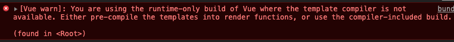

# NPM

在用 Vue 构建大型应用时推荐使用 NPM 安装。NPM能够很好的和webpack模块打包器配合使用。

```shell
npm install vue --save
```

**main.js**

```js
import Vue from 'vue'

const app = new Vue({
  el: '#app',
  data: {
    message: 'hello webpack'
  }
})
```

重新打包、运行之后，会出现如下错误



这是因为vue包括了`runtime-onle` 和 `runtime-compiler`版本。在第二个版本中不支持`template`。

所以我们只需要修改webpack的配置，添加如下内容即可

**webpack.config.js**

```js
module.exports = {
  ......
  resolve: {
    alias: {
      'vue$': 'vue/dist/vue.esm.js'
    }
  }
};
```

