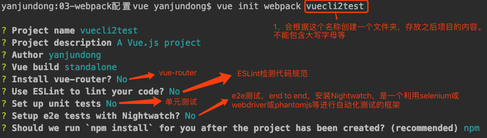

# 一、vue

div块中的内容是以组件(component)的方式引用的，需要创建单独的`App.vue`

**main.js**

```js
import APP from "./vue/APP.vue";

const app = new Vue({
  el: '#app',
  template: `<APP></APP>`,
  components: {
    APP
  }
})
```

**App.vue**

```vue
//组件的template
<template>
  <div>
    <p>{{message}}</p>
  </div>
</template>

<script>
  export default {
    name: "APP",
    data: function () {
      return {
        message: 'hello,webpack'
      }
    },
    methods: {

    }
  }
</script>
//在其中可以添加样式
<style scoped>

</style>
```

在`npm run build`时，出现错误如下。。可以知道是需要引入合适的loader。

```shell
ERROR in ./src/vue/APP.vue
Module parse failed: /Users/yanjundong/WebstormProjects/vueProject02/01-webpack的使用/03-webpack配置vue/src/vue/APP.vue Unexpectedn (1:0)
You may need an appropriate loader to handle this file type.
| <template>
|   <div>
|     <p>{{message}}</p>
 @ ./src/main.js 13:0-32
```

```shell
npm install --save-dev vue-loader vue-template-compiler
```


## 1、插槽

### 1）、插槽内容

存在组件cpn，内容如下：

```html
<div>
  <h2>我是组件</h2>
  <slot></slot>
</div>
```

在引用时

```html
<cpn>
	<button>按钮</button>
</cpn>
```

当组件渲染的时候，`<slot></slot>` 将会被替换为 `<button>按钮</button>`。


### 2）、后备内容

在 `<slot></slot>` 内有一个默认内容（后备内容），只有当父级组件提供内容时才取代后备内容。


### 3）、具名插槽

我们需要多个插槽，需要给每个插槽一个名字。

```html
<div class="container">
  <header>
    <slot name="header"></slot>
  </header>
  <main>
    <slot></slot>
  </main>
  <footer>
    <slot name="footer"></slot>
  </footer>
</div>
```

在父级组件引用时

- 方法一:在一个 `<template>` 元素上使用 `v-slot` 指令

  ```html
  <cpn>
      <template v-slot:header>
        <h1>Here might be a page title</h1>
      </template>
  
      <template v-slot:default>
        <p>A paragraph for the main content.</p>
        <p>And another one.</p>
      </template>
  
      <template v-slot:footer>
        <p>Here's some contact info</p>
      </template>
    </cpn>
  ```

  

### 4）、作用域插槽

在 `插槽内容` 中需要能够访问子组件的数据。

```html
<!--插槽prop-->
  <div>
    <!--绑定在 <slot> 元素上的 attribute 被称为插槽 prop-->
    <slot name="header" :user="user">{{ user.lastName }}</slot>
  </div>
```

在父级组件引用时：

```html
<cpn>
  <!--在父级作用域中，可以使用带值的 v-slot 来定义我们提供的插槽 prop 的名字-->
  <template v-slot:header="slot">
    {{ slot.user.firstName }}
  </template>
</cpn>
```


# 二、Vue CLI

## 1、什么是Vue CLI

- 使用Vue CLI开发大型项目时，需要考虑代码目录结构、项目结构和部署、热加载、单元测试等，脚手架能够帮助我们完成这些事情。
- 使用vue-cli可以快速搭建Vue开发环境，以及对应的webpack配置

## 2、使用前提

- Node环境
- webpack

## 3、安装脚手架

- 安装Vue脚手架

  ```sh
  npm install -g @vue/cli
  ```

## 4、创建一个项目

### 1）、vue create

运行一下命令来创建一个新项目：

```sh
vue create hello-world
```


### 2）、拉取2.x模版（旧版本）

Vue CLI >= 3 和旧版使用了相同的 `vue` 命令，所以 Vue CLI 2 (`vue-cli`) 被覆盖了。如果你仍然需要使用旧版本的 `vue init` 功能，你可以全局安装一个桥接工具：

```shell
npm install -g @vue/cli-init
# `vue init` 的运行效果将会跟 `vue-cli@2.x` 相同
vue init webpack my-project
```




# 三、路由

## 1、前端路由和后端路由

### 1）、后端路由

早期的网站开发，整个的html页面是由服务器来渲染的

- 服务器将url和页面对应起来返回给前端
- **<span style = 'color: green'>后端渲染</span>**：服务器直接生产渲染好对应的html页面，返回给客户端进行展示

### 2）、前后端分离

后端只负责数据，不负责任何界面的内容

- 随着Ajax的出现，有了前后端分离的模式
- 前端通过url从静态资源服务器获取`html+css+js`，通过`Ajax`从服务器获取数据进行显示
- **<span style = 'color: green'>前端渲染</span>**：浏览器显示的网页大部分内容，都是由前端写的js代码在浏览器中执行，少部分数据来自服务器，最终渲染出网页

### 3）、前端路由

SPA页面

- SPA：单页面富应用
- 在前后端分离的基础上加上了一层前端路由
- 也就是前端来维护一套路由规则
- **<span style = 'color: green'>核心</span>**：改变url，但是页面不进行整体的刷新

## 2、Vue Router

### 1）、安装

```sh
npm install vue-router
```

### 2）、配置

**src/router/index.js**

```js
import Vue from 'vue'
//配置路由相关的信息
import Router from 'vue-router'
import HelloWorld from '@/components/HelloWorld'

//1、通过Vue.use(插件)，安装插件
Vue.use(Router)

//2、创建Router对象
const router = new Router({
  //routes：配置路由和组件之间的对应关系
  //一个URL对应一个组件
  routes: [
    {
      path: '/home',
      component: home
    },{
      path: '/about',
      component: about
    }
  ]
})

//3、将router对象传入到Vue实例
export default router
```


**src/main.js**

```js
import Vue from 'vue'
import App from './App'
import router from './router'

Vue.config.productionTip = false

/* eslint-disable no-new */
new Vue({
  el: '#app',
  router,  //在Vue实例中挂载创建的路由实例
  render: h => h(App)
})
```

### 3）、使用

- 创建路由组件
- 配置路由映射：组件和路径映射关系
- 通过`<router-link>`和`<router-view>`使用路由


ps: `<router-link>`的其他属性

1. tag：可以指定`<router-link>`之后被渲染成什么组件，例如`<router-link to="/home" tag="button">`
2. replace：不会留下history记录，所以指定replace的情况下，后退键返回无效。例如`<router-link to="/home" tag="button" replace>`
3. 当`<router-link>`对应的路由匹配成功时，会自动给当前元素设置一个`router-link-active`的class

### 4）、命名路由

有时候，通过一个名称来标识一个路由显得更方便一些，特别是在链接一个路由，或者是执行一些跳转的时候。你可以在创建 Router 实例的时候，在 `routes` 配置中给某个路由设置名称。

```js
const router = new VueRouter({
  routes: [
    {
      path: '/user/:userId',
      name: 'user',
      component: User
    }
  ]
})
```

要链接到一个命名路由，可以给 `router-link` 的 `to` 属性传一个对象：

```js
<router-link :to="{ name: 'user', params: { userId: 123 }}">User</router-link>
```


### 5）、重定向

重定向也是通过 `routes` 配置来完成

```js
const router = new Router({
  routes: [
    {
      path: '/',  
      redirect: '/home'
    }
  ]
})
```

重定向的目标也可以是一个命名的路由：

```js
const router = new VueRouter({
  routes: [
    {
      path: '/a', 
     	redirect: { name: 'foo' }
    }
  ]
})
```

甚至是一个方法，**动态**返回重定向目标：

```js
const router = new VueRouter({
  routes: [
    { path: '/a', redirect: to => {
      // 方法接收 目标路由 作为参数
      // return 重定向的 字符串路径/路径对象
    }}
  ]
})
```


### 6）、HTML5 History模式

`vue-router` 默认 hash 模式 —— 使用 URL 的 hash 来模拟一个完整的 URL，于是当 URL 改变时，页面不会重新加载。

如果不想要很丑的 hash，我们可以用路由的 **history 模式**，这种模式充分利用 `history.pushState`API 来完成 URL 跳转而无须重新加载页面。

```js
const router = new VueRouter({
  mode: 'history',
  routes: [...]
})
```

当你使用 history 模式时，URL 就像正常的 url，例如 `http://yoursite.com/user/id`。


### 7）、编程式的导航

除了使用 `<router-link>` 创建 a 标签来定义导航链接，我们还可以借助 router 的实例方法，通过编写代码来实现。

在 Vue 实例内部，你可以通过` $router `访问路由实例。因此你可以调用 `this.$router.push`。这个方法会向history栈添加一个新的记录。

|          声明式           | 编程式             |
| :-----------------------: | ------------------ |
| `<router-link :to="...">` | `router.push(...)` |

```js
// 字符串
this.$router.push('home')

// 对象
this.$router.push({ path: 'home' })

// 命名的路由
this.$router.push({ name: 'user', params: { userId: '123' }})

// 带查询参数，变成 /register?plan=private
this.$router.push({ path: 'register', query: { plan: 'private' }})
```


| 声明式                            | 编程式                |
| --------------------------------- | --------------------- |
| `<router-link :to="..." replace>` | `router.replace(...)` |

```js
this.$router.replace('/home')
```


### 8）、动态路由匹配

我们现在有一个`User`组件，但对于所有userID各不相同的用户，都需要使用这个组件来渲染。那么，我们可以在`vue-router`的路由路径中使用"动态路径参数"(dynamic segment) 来达到这个效果：

**index.js**

```js
const router = new Router({
  routes: [
   	{
      // 动态路径参数 以冒号开头
      path: '/user/:userId',
      component: user
    }
  ]
})
```

现在，像 `/user/zhangsan` 和 `/user/lisi` 都将映射到相同的路由。


当匹配到一个路由时，参数值会被设置到`this.$route.params` ，可以在每个组件内使用。于是，我们可以在User的模版中，输出当前用户ID：

```vue
<template>
  <div>
    <h2>{{$route.params.userId}}</h2>
  </div>
</template>
```


### 9）、嵌套路由

实际生活中的应用界面，通常由多层嵌套的组件组合而成。

步骤：

1. 创建对应的子组件；
2. 在路由配置中配置对应的子路由；
3. 在组件内部使用`<router-view>`

现在项目中存在子组件`News` 和 `Message`

**index.js**

```js
const home = () => import('../components/Home')
const news = () => import('../components/News')
const message = () => import('../components/Message')

const router = new Router({
  routes: [
    {
      path: '/home',
      component: home,
      children: [
        {  //设置一个默认路由
          path : '',
          redirect: 'news'
        }, {
          path: 'news',
          component: news
        },{
          path: 'message',
          component: message
        }
      ]
    }
  ],
  mode: 'history'
})
```


**Home.vue**

```vue
<template>
  <div>
    <h2>我是Home</h2>
    <h2>我是Home内容</h2>
    <router-link to="/home/news">新闻</router-link>
    <router-link to="/home/message">消息</router-link>
    <router-view></router-view>
  </div>
</template>
```


当 `/home/news` 匹配成功时，message 组件的内容会被渲染在 `Home` 的 <router-view>中。


### 10）、路由懒加载

当打包构建应用时，JavaScript 包会变得非常大，影响页面加载。如果我们能把不同路由对应的组件分割成不同的代码块，然后当路由被访问的时候才加载对应组件，这样就更加高效了。

实现路由组件的懒加载方式：

1. 结合 Vue 的异步组件和 Webpack 的代码分析

   ```js
   const Home = resolve => require.ensure([], () => resolve(require('../components/Home.vue')), () => resolve(require('../components/Home.vue'))
   ```

2. AMD写法

   ```js
   const About = resolve => require(['../components/About.vue'], resolve);
   ```

3. 简单的写法

   ```js
   const Foo = () => import('./Foo.vue')
   
   const router = new VueRouter({
     routes: [
       { 
         path: '/foo', 
         component: Foo 
       }
     ]
   })
   ```

#### 把组件按组分块

有时候我们想把某个路由下的所有组件都打包在同个异步块 (chunk) 中。只需要使用 [命名 chunk](https://webpack.js.org/guides/code-splitting-require/#chunkname)，一个特殊的注释语法来提供 chunk name (需要 Webpack > 2.4)。

```js
const Foo = () => import(/* webpackChunkName: "group-foo" */ './Foo.vue')
const Bar = () => import(/* webpackChunkName: "group-foo" */ './Bar.vue')
const Baz = () => import(/* webpackChunkName: "group-foo" */ './Baz.vue')
```

Webpack 会将任何一个异步模块与相同的块名称组合到相同的异步块中。

### 11）、参数传递

- **$route.query**

  - 类型: `Object`

    一个 key/value 对象，表示 URL 查询参数。例如，对于路径 `/foo?user=1`，则有 `$route.query.user == 1`，如果没有查询参数，则是个空对象。

已经存在Profile组件，在`index.js`中添加配置

**App.vue**

```vue
<template>
  <div id="app">
    ...
    <router-link :to="{path: '/profile', query: {name: 'yanjundong', age: 23}}" tag="button">我的</router-link>
    <router-view></router-view>
  </div>
</template>
```

**Profile.vue**

```vue
<template>
  <div>
    <h2>我是Profile</h2>
    <h2>{{$route.query.name}}</h2>
    <h2>{{$route.query.age}}</h2>
  </div>
</template>
```

页面路径为`http://localhost:8080/profile?name=yanjundong&age=23`


### 12）、路由组件传参

在组件中使用 `$route` 会使之与其对应路由形成高度耦合，从而使组件只能在某些特定的 URL 上使用，限制了其灵活性。

使 `props` 可以将组件和路由解耦：

**Hello.vue**

```vue
<template>
  <div>
    <h2 class="hello">Hello {{name}}</h2>
  </div>
</template>

<script>
  export default {
    name: 'Hello',
    props: {
      name: {
        type: String,
        default: 'Vue!'
      }
    }
  }
</script>
```


#### 布尔模式

如果 `props` 被设置为 `true`，`route.params` 将会被设置为组件属性。

**index.js**

```js
const router = new VueRouter({
  routes: [
    { 
      path: '/hello/:name',
      component: Hello,
      props: true
    }
  ]
})
```

`http://localhost:8080/hello/you`显示为`Hello you`

#### 对象模式

**index.js**

```js
const router = new VueRouter({
  routes: [
    { 
      path: '/static',
      component: Hello,
      props: { name: 'world' }
    }
  ]
})
```

显示为`Hello world`

####  函数模式

**index.js**

```js
function dynamicPropsFn (route) {
  const now = new Date()
  return {
    name: (now.getFullYear() + parseInt(route.params.years)) + '!'
  }
}

const router = new VueRouter({
  routes: [
    { // custom logic for mapping between route and props
      path: '/dynamic/:years',
      component: Hello,
      props: dynamicPropsFn
    }
  ]
})
```

显示为`Hello 2021！`


### 13）、导航守卫

#### 全局前置守卫

你可以使用 `router.beforeEach` 注册一个全局前置守卫：

**index.js**

```js
const router = new VueRouter({ ... })

router.beforeEach((to, from, next) => {
  // ...
})
```

每个守卫方法接受三个参数：

- **`to: Route`**: 即将要进入的目标 路由对象
- **`from: Route`**: 当前导航正要离开的路由
- **`next: Function`**: 一定要调用该方法来 **resolve** 这个钩子。执行效果依赖 `next` 方法的调用参数。
  - **`next()`**: 进行管道中的下一个钩子。
  - **`next(false)`**: 
  - **`next('/')` 或者 `next({ path: '/' })`**: 
  - **`next(error)`**: 

一定要调用 `next` 方法，否则钩子就不会被resolved。


#### 全局解析守卫

> 2.5.0 新增


#### 全局后置钩子

和守卫不同的是，全局后置钩子不会接受 `next` 函数也不会改变导航本身：

```js
router.afterEach((to, from) => {
  // ...
})
```


#### 路由独享的守卫

你可以在路由配置上直接定义 `beforeEnter` 守卫：

```js
const router = new VueRouter({
  routes: [
    {
      path: '/foo',
      component: Foo,
      beforeEnter: (to, from, next) => {
        // ...
      }
    }
  ]
})
```

这些守卫与全局前置守卫的方法参数是一样的。


#### 组件内的守卫

可以在路由组件内直接定义以下路由导航守卫：

- `beforeRouteEnter`
- `beforeRouteUpdate` (2.2 新增)
- `beforeRouteLeave`

```js
<script>
  export default {
    name: "About",
    beforeRouteEnter (to, from, next) {
      // 在渲染该组件的对应路由被 confirm 前调用
      // 不！能！获取组件实例 `this`
      // 因为当守卫执行前，组件实例还没被创建
    },
    beforeRouteUpdate (to, from, next) {
      // 在当前路由改变，但是该组件被复用时调用
      // 举例来说，对于一个带有动态参数的路径 /foo/:id，在 /foo/1 和 /foo/2 之间跳转的时候，
      // 由于会渲染同样的 Foo 组件，因此组件实例会被复用。而这个钩子就会在这个情况下被调用。
      // 可以访问组件实例 `this`
    },
    beforeRouteLeave (to, from, next) {
      // 导航离开该组件的对应路由时调用
      // 可以访问组件实例 `this`
    }
  }
</script>
```


这个离开守卫通常用来禁止用户在还未保存修改前突然离开。该导航可以通过 `next(false)` 来取消。

```js
beforeRouteLeave (to, from, next) {
  const answer = window.confirm('Do you really want to leave? you have unsaved changes!')
  if (answer) {
    next()
  } else {
    next(false)
  }
}
```


# 四、Vuex

## 1、Vuex是什么？

Vuex 是一个专为 Vue.js 应用程序开发的**状态管理模式**。

它采用**集中式存储管理**应用的所有组件的状态，并以相应的规则保证状态以一种可预测的方式发生变化。Vuex 也集成到 Vue 的官方调试工具 [devtools extension](https://github.com/vuejs/vue-devtools)，提供了诸如零配置的 time-travel 调试、状态快照导入导出等高级调试功能。

<h2>什么是状态管理模式？</h2>

下面是一个简单的 Vue 计数应用：

```vue
<template>
  <div id="app">
    <h2>{{count}}</h2>
    <button @click="count--">-</button>
    <button @click="count++">+</button>
  </div>
</template>
```

这个状态自管理应用包含以下几个部分：

- **state**，组件的数据（count）；
- **view**，以声明方式将状态显示到视图（将count显示到网页）；
- **actions**，用户的操作导致的状态变化（-和+按钮）。

以上就是一个表示“单向数据流”的例子，简单示意图如下：


但是，当我们的应用遇到**多个组件共享状态**时，单向数据流的简洁性很容易被破坏：

- 多个视图依赖于同一状态。
- 来自不同视图的行为需要变更同一状态。

这时候，我们就需要一个“管家”来管理多个组件之间共享的状态。

当然我们可以自己封装一个对象来管理，但是Vuex提供的最大的便利就是**响应式**——当数据发生变化时，view能够实时的发生变化。

## 2、安装

<h2>NPM</h2>

```sh
npm install vuex --save
```

## 3、开始


每一个 Vuex 应用的核心就是 **store（仓库）**。“store”基本上就是一个容器，它包含着你的应用中大部分的**状态 (state)**。Vuex 和单纯的全局对象有以下两点不同：

1. Vuex 的状态存储是**响应式**的。当 Vue 组件从 store 中读取状态的时候，若 store 中的状态发生变化，那么相应的组件也会相应地得到高效更新。
2. 你不要直接改变 store 中的状态。改变 store 中的状态的唯一途径就是显式地**提交 (commit) mutation**。这样使得 `Devtools` 方便地跟踪每一个状态的变化，从而能够更好的了解自己的应用。

<h2>最简单的Store</h2>

**index.js**

```js
const store = new Vuex.Store({
  state: {
    count: 1000
  },
  mutations: {
    dedcrement(state) {
      state.count--
    },
    increment (state) {
      state.count++
    }
  }
})
```


**App.vue**

```vue
<template>
  <div id="app">
    <h2>{{$store.state.count}}</h2>
    <button @click="$store.commit('dedcrement')">-</button>
    <button @click="$store.commit('increment')">+</button>
  </div>
</template>
```

## 4、核心概念

### 1）、State

<h2>单一状态树</h2>

Vuex 使用**单一状态树**——用一个对象就包含了全部的状态。使它作为唯一的数据源而存在。

### 2）、Getter

`getter` 可以认为是 store 的计算属性。就像计算属性一样，getter 的返回值会根据它的依赖被**缓存**起来，且只有当它的依赖值发生了改变才会被重新计算。

Getter 接受 state 作为其第一个参数：

**index.js**

```js
const store = new Vuex.Store({
  state: {
    student: [
      {id:1, name: 'yanjundong', age: 18},
      {id:2, name: 'wangwu', age: 36},
      {id:3, name: 'li', age: 10},
      {id:4, name: 'zhangsan', age: 24}
    ]
  },
  getters:{
    greaterAgeStus: state => {
      return state.student.filter(s => s.age >= 20)
    }
  },
})
```

<h2>通过属性访问</h2>

Getter 会暴露为 `store.getters` 对象，你可以以属性的形式访问这些值：

```js
$store.getters.greaterAgeStus	//	->	[ { "id": 2, "name": "wangwu", "age": 36 }, { "id": 4, "name": "zhangsan", "age": 24 } ]
```

Getter 也可以接受其他 getter 作为第二个参数：

```js
const store = new Vuex.Store({
  state: {
    ...
  },
  getters:{
    ...
    greaterAgeCount: (state, getters) => {
      return getters.greaterAgeStus.length
    }
  },
})
```

```js
$store.getters.greaterAgeCount	//	->	2
```

注意，getter 在通过属性访问时是作为 Vue 的响应式系统的一部分缓存其中的。


<h2>通过方法访问</h2>

你也可以通过让 getter 返回一个函数，来实现给 getter 传参。

```js
getters:{
    ...
    findByAge: state => {
      return (age) => {
        return state.student.filter(s => s.age >= age)
      }
    }
  },
```

```js
$store.getters.findByAge(25)	//	->	[ { "id": 2, "name": "wangwu", "age": 36 } ]
```


### 3）、Mutation

更改 Vuex 的 store 中的状态的唯一方法是提交 mutation。

> 以上的开始中已经有了Mutation的简单应用
>

<h2> 提交载荷（Payload）——携带参数</h2>

你可以向 `store.commit` 传入额外的参数，即 mutation 的 **载荷（payload）**：

```js
// ...
mutations: {
  increment (state, n) {
    state.count += n
  }
}
```

```js
store.commit('increment', 10)
```

在大多数情况下，载荷应该是一个对象，这样可以包含多个字段并且记录的 mutation 会更易读。

```js
// ...
mutations: {
  increment (state, payload) {
    state.count += payload.amount
  }
}
```

```js
store.commit('increment', {
  amount: 10
})
```


<h2> 另外一种提交方式</h2>

直接使用包含 `type` 属性的对象：

```js
store.commit({
  type: 'increment',
  amount: 10
})
```

当使用对象风格的提交方式，整个的对象都作为参数传给mutations函数

```js
mutations: {
  increment (state, payload) {	//payload:	{type: "increment", count: 10}
    state.count += payload.amount
  }
}
```


<h2>Mutation 需遵守 Vue 的响应规则</h2>

Vuex 的 store 中的状态是响应式的，当我们变更状态时，监视状态的 Vue 组件也会自动更新。

因此我们需要遵守Vue的一些规则：

1. 最好提前在 store 中初始化好所有所需属性。

2. 当需要给对象上添加新属性时，应该

   - 使用 `Vue.set(obj, 'newProp', 123)`
   - 用新对象给旧对象重新赋值

   ```js
   state: {
     ...
     info: {
         name: 'iphone',
         version: '8plus',
         storage: '64G'
       }
   },
   mutations: {
       updateInfo(state) {
         //state.info.storage = '128G';  //响应式
         //state.info.price = '¥4300'; //做不到响应式
         Vue.set(state.info, 'price', '¥4300');  //响应式
   
         //delete state.info.storage;  //不能响应
         //Vue.delete(state.info, 'storage');  //响应式
       }
     }
   ```

   

<h2>使用常量替代 Mutation 事件类型</h2>

使用常量替代 mutation 事件类型，同时把这些常量放在单独的文件中可以让你的代码合作者对整个 app 包含的 mutation 一目了然：

```js
// mutation-types.js
export const SOME_MUTATION = 'SOME_MUTATION'
```

```js
// store.js
import Vuex from 'vuex'
import { SOME_MUTATION } from './mutation-types'

const store = new Vuex.Store({
  state: { ... },
  mutations: {
    // 我们可以使用 ES2015 风格的计算属性命名功能来使用一个常量作为函数名
    [SOME_MUTATION] (state) {
      // mutate state
    }
  }
})
```

```js
//App.vue
import { SOME_MUTATION } from './mutation-types'
this.$store.commit(SOME_MUTATION);
```

<h2>Mutation 必须是同步函数</h2>

Vuex要求Mutation里的方法必须是同步方法，主要原因是：

- devtools可以帮助我们捕捉mutation的快照
- 然而， mutation 中的异步函数中的回调让这不可能完成


### 4）、Action

Action 类似于 mutation，不同在于：

- Action 提交的是 mutation，而不是直接变更状态。
- Action 可以包含任意异步操作。

一个简单的 action：

```js
const store = new Vuex.Store({
  state: {
    count: 0
  },
  mutations: {
    increment (state) {
      state.count++
    }
  },
  actions: {
    //在 action 内部可以执行异步操作
    incrementAsync (context) {	//context是与store 实例具有相同方法和属性的对象
    setTimeout(() => {
      context.commit('increment')
    }, 1000)
  }
  }
})
```

<h2>分发 Action</h2>

Action 通过 `store.dispatch` 方法触发：

```js
this.$store.dispatch('increment')
```

<h2>载荷（Payload）</h2>

```js
// 以载荷形式分发
store.dispatch('incrementAsync', {
  amount: 10
})

// 以对象形式分发
store.dispatch({
  type: 'incrementAsync',
  amount: 10
})
```

<h2>执行后回调</h2>

1. 可以利用 Action 的载荷来实现——在参数中传递一个参数

2. 利用promise实现

   ```js
   //index.js，actions中的函数返回一个promise对象
   actions: {
       incrementAsync (context, message) {
         return new Promise(((resolve, reject) => {
           setTimeout(() => {
             console.log(message);
             context.commit('increment')
             resolve('成功了！');  //成功
           }, 1000)
         }))
       }
     }
   ```

   ```js
   this.$store
             .dispatch('incrementAsync', '111')
             .then((msg) => {	//成功之后调用
               console.log(msg);
             })
   					.catch((msg) => {	//失败之后调用
               console.log(msg);
             })
   ```

   `this.$store.dispatch('incrementAsync', '111')` 执行之后就会把返回结果替代为自身。


### 5）、Module

因为使用了单一状态树，只允许有一个Store对象，但是当应用变得非常复杂时，store 对象就有可能变得相当臃肿。

为了解决这个问题，Vuex 允许我们将 store 分割成**模块（module）**。每个模块拥有自己的 state、mutation、action、getter、甚至是嵌套子模块。

```js
const moduleA = {
  state: { ... },
  mutations: { ... },
  actions: { ... },
  getters: { ... }
}

const moduleB = {
  state: { ... },
  mutations: { ... },
  actions: { ... }
}

const store = new Vuex.Store({
  modules: {
    a: moduleA,
    b: moduleB
  }
})

store.state.a // -> moduleA 的状态
store.state.b // -> moduleB 的状态
```


<h2>模块的局部状态</h2>

```js
const moduleA = {
  state: {
    name: 'zhangsan'
  },
  mutations: {
    updateName(state) { // 这里的 `state` 对象是模块的局部状态
      state.name = 'lisi';
    }
  },
  actions: {
    asyncUpdateName(context) {
      console.log(context);
      context.commit('updateName')
    }
  },
  getters: {
    fullName(state, getters, rootState) {
      return state.name + rootState.count;
    }
  }
}

const store = new Vuex.Store({
  modules: {
    a: moduleA
  }
})

```

```js
$store.state.a.name
this.$store.commit('updateName')
this.$store.dispatch('asyncUpdateName')
this.$store.getters.fullName
```


## 5、项目结构

Vuex规定了一些需要遵守的规则：

1. 应用层级的状态应该集中到单个 store 对象中。
2. 提交 **mutation** 是更改状态的唯一方法，并且这个过程是同步的。
3. 异步逻辑都应该封装到 **action** 里面。

```sh
├── index.html
├── main.js
├── api
│   └── ... # 抽取出API请求
├── components
│   ├── App.vue
│   └── ...
└── store
    ├── index.js          # 我们组装模块并导出 store 的地方
    ├── actions.js        # 根级别的 action
    ├── mutations.js      # 根级别的 mutation
    └── modules
        ├── cart.js       # 购物车模块
        └── products.js   # 产品模块
```


# 五、Axios

## 1、什么是axios？

Axios 是一个基于 promise 的 HTTP 库，可以用在浏览器和 node.js 中。

## 2、特性

## 3、安装

```sh
npm install --save axios
```

## 4、请求方法

```js
import axios from 'axios'

//	axios(url[, config])
axios({
  url: 'http://123.207.32.32:8000/home/multidata'
}).then(res => {
  console.log(res);
})

//	axios(config)
// 发送 POST 请求
axios({
  method: 'post',
  url: 'http://123.207.32.32:8000/user/12345',
  data: {
    firstName: 'Fred',
    lastName: 'Flintstone'
  }
});
// 发送GET请求
axios({
  method:'get',
  url:'http://bit.ly/2mTM3nY',
  params:{
    
  }
})
  .then(function(response) {
  response.data.pipe(fs.createWriteStream('ada_lovelace.jpg'))
});
```

axios.all(iterable)

axios.spread(callback)


## 5、响应结构

```js
{
  // `data` 由服务器提供的响应
  data: {},

  // `status` 来自服务器响应的 HTTP 状态码
  status: 200,

  // `statusText` 来自服务器响应的 HTTP 状态信息
  statusText: 'OK',

  // `headers` 服务器响应的头
  headers: {},

   // `config` 是为请求提供的配置信息
  config: {},
 	// 'request'
  // `request` is the request that generated this response
  // It is the last ClientRequest instance in node.js (in redirects)
  // and an XMLHttpRequest instance the browser
  request: {}
}
```


## 6、并发请求

处理并发请求的助手函数：

- axios.all(iterable)
- axios.spread(callback)

```js
function getUserAccount() {
  return axios.get('/user/12345');
}

function getUserPermissions() {
  return axios.get('/user/12345/permissions');
}

axios.all([getUserAccount(), getUserPermissions()])
  .then(axios.spread(function (acct, perms) {
    // 两个请求现在都执行完成
  }));

axios.all([getUserAccount(), getUserPermissions()])
  .then((results) => {
    // 两个请求现在都执行完成，results[0]为第一个请求的结果,results[1]为第二个请求的结果
  }));
```


## 7、创建实例

如果有一些配置比较特殊，不能够使用默认的axios，可以使用自定义配置新建一个 axios 实例

```js
const instance = axios.create({
  baseURL: 'https://some-domain.com/api/',
  timeout: 1000,
  headers: {'X-Custom-Header': 'foobar'}
});
```

自定义的实例和默认的axios实例有着一样的方法。


## 8、配置

可以指定将被用在各个请求的配置默认值

<h2>全局的axios默认配置</h2>

```js
axios.defaults.baseURL = 'https://api.example.com';
axios.defaults.timeout = 5000;
```


<h2>自定义实例默认值</h2>

在创建axios实例时自定义配置。


<h2>配置的优先顺序</h2>

配置会以一个优先顺序进行合并。这个顺序是：在 `lib/defaults.js` 找到的库的默认值，然后是实例的 `defaults` 属性，最后是请求的 `config` 参数。后者将优先于前者。


## 9、拦截器

在请求或响应成功或者失败时拦截它们。

```js
// 添加请求拦截器
axios.interceptors.request.use(function (config) {
    // 在发送请求之前做些什么
  	console.log(config);	//config就是请求的配置
    return config;	
  }, function (error) {
    // 对请求错误做些什么
    return Promise.reject(error);
  });

// 添加响应拦截器
axios.interceptors.response.use(function (response) {
    // 对响应数据做点什么
    return response;
  }, function (error) {
    // 对响应错误做点什么
    return Promise.reject(error);
  });
```

可以为自定义 axios 实例添加拦截器

```
const instance = axios.create();
instance.interceptors.request.use(function () {/*...*/});
```


