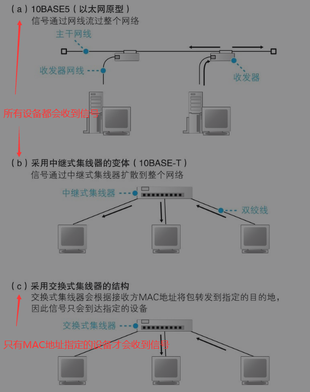
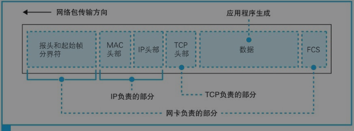
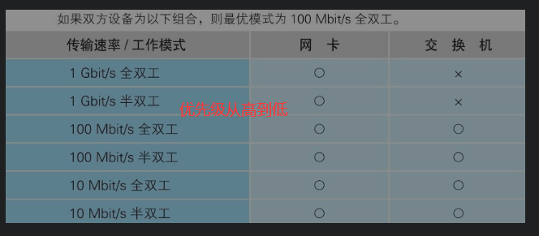
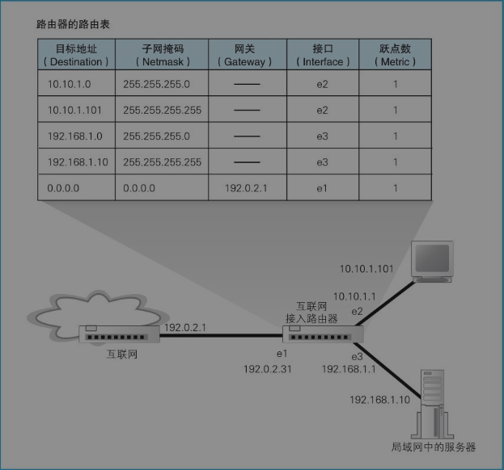
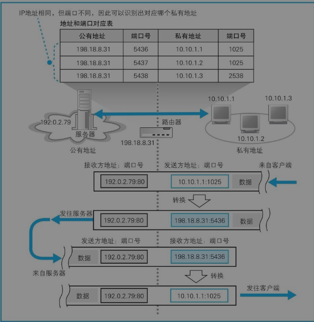

   # 二、用电信号传输 TCP/IP 数据

## 1 创建套接字

### 1.1 套接字的实体就是通信控制信息

​		在协议栈内部用一块用于存放控制信息的内存空间，里面记录了控制通信操作的控制信息。包括：通信对象的IP地址、端口号、通信操作的进行状态等。==套接字只是一个概念，并不存在实体。==

​		协议栈在执行操作时需要查看这些控制信息。例如，需要查看套接字中的通信对象IP地址和端口号，以便发送数据。

> 协议栈就是根据套接字中记录的控制信息来工作的。


在 windows 中可以通过 `netstat` 命令显示套接字内容：


`netstat` 命令是用于显示套接字内容的命令，-ano  选项表示下面的意思：

a 不仅显示正在通信的套接字，还显示包括尚未开始通信等状态的所有套接字

n 显示IP地址和端口号

o 显示使用该套接字的程序PID

### 1.2 调用socket时的操作

​		应用程序调用socket申请创建套接字。协议栈会先为该套接字分配所需的内存空间，然后向其写入初始状态，也就是控制信息。

​		接下来，就会把该套接字的 `描述符` 告诉给应用程序。

> 在该阶段，套接字中并没有存储服务器的 IP 和端口号，服务器也还不知道客户端的 IP 和端口号。等在 `连接服务器阶段` 才会交换这些控制信息。

## 2 连接服务器

### 2.1 连接的意思

`连接` 实际就是通信双方交换控制信息：

- 浏览器把服务器的 IP 和端口号 告诉给协议栈
- 客户端告诉服务器自己的IP和端口号
- 准备数据收发的一连串操作

在连接操作的过程中，还会分配一块缓冲区，它的作用是：临时存放要收发的数据。

### 2.2 连接操作的实际过程


## 3 收发数据

### 3.1 将 HTTP 请求消息交给协议栈

协议栈并不是一收到数据就马上发送出去，而是把放到缓冲区等待，这样做的目的是为了避免大量的小包，导致网络效率下降。对于什么时候才发送，有以下几个判断因素：

- 每个网络包的数据长度。

  > MTU：一个网络包的数据长度，以太网中一般是1500字节。
  >
  > MSS：除去头部之后，一个网络包所能容纳的 TCP 数据的最大长度。

- 时间。

### 3.2 对较大的数据进行拆分

如果发送缓冲区中的内容拆过了 MSS 的长度，TCP模块 就会进行拆分，并在每一块的前面加上 TCP 头部，然后交给 IP模块 来执行数据的发送操作。


TCP 采用序号和ACK的方法来确定对方是否收到了数据，在得到对方确定之前，发送过的数据都会保存在缓冲区中。如果没有收到对方返回的 ACK号，那么就会重新发送这些包。

​		归功于 TCP 的这一机制，网卡、集线器、路由器都没有错误补偿机制，一旦检测到错误就直接丢弃相应的包。

### 3.3 根据网路包平均往返时间调整 ACK 号等待时间

​		当网络传输拥堵时，ACK号的返回就会变慢，这时应该把等待时间设置的长些，否则就会有大量的包重传，导致网络更加拥堵。但是如果设置的时间很长，包的重传就会出现很大的延迟，也会导致网络速度变慢。

​		TCP 采用了动态调整等待时间的方法，这个时间是根据ACK号返回所需的时间来判断的。

### 3.4 使用窗口有效管理 ACK 号


`滑动窗口方法` 造成的问题是：发送包的频率会超过接收方的处理能力。

解决办法：接收方告诉发送方自己最多能够接受多少数据，然后发送方根据这个值进行控制。

### 3.5 接收 HTTP 响应消息

​		浏览器在委托协议栈发送请求消息之后，会调用 read 程序来获取响应消息。如果响应消息还没有返回，这时接收缓冲区中没有数据，协议栈就会将应用程序挂起，等响应消息到达之后再执行接收操作。

​		协议栈接受数据：检查是否有数据丢失，并返回ACK；将数据块放到接受缓冲区，并拼接，最后把数据交给应用程序（将接受到的数据复制到应用程序指定的内存地址）。

## 4 从服务器断开并删除套接字

### 4.1 数据发送完毕后断开连接                                                                                                                                    


> 在 HTTP1.0 中，web服务器返回响应消息后，服务器就会发起断开过程。
>
> 在 HTTP1.1 中，服务器返回响应消息后，客户端仍然可以发起下一次请求消息，如果接下来没有请求要发送，客户端就会发起断开过程。

### 4.2删除套接字

 通信结束后，并不是立即就删除该套接字，而是会等待一段时间之后再删除。原因：防止误操作。

例如：

1. 客户端先发起FIN
2. 服务器返回ACK
3. 服务器发起FIN
4. 客户端返回ACK

如果在第4步中网络包丢失了，这时服务器就会重发一次 FIN。如果这时在客户端中该套接字已经被删除，并且已经分配给另一个应用程序使用，这时这个FIN就会跑到这个新的套接字里，新的套接字就会执行断开过程。发生了误操作。

## 5 IP与以太网的包收发操作

### 5.1 包收发操作

`路由器` 根据目的IP地址得到下一个路由器的位置，是按照 `IP 规则` 传输包。

`集线器` 将包传输给下一个路由器，是按照 `以太网规则` 传输包。


IP和以太网规则就像：IP规则计算出位置，然后把位置告诉以太网规则，让它去干活。

这样分开的好处是：可以更好地根据需要使用各种通信技术。

### 5.2 生成 IP 头部

​		IP模块在生成 IP 头部时，最重要的内容就是 IP 地址，包括发送方的 IP 地址和接收方的 IP 地址，其中接收方的 IP 地址是由 TCP模块告诉的，而TCP又是在连接阶段从应用程序那里获得的。

​		关于发送方的 IP 地址，如果计算机上有多块网卡，IP模块就需要通过 “路由表” 来得到应该把包发送给哪个网卡。

> IP地址实际上是分配给网卡的，因此如果计算机上有多块网卡，每一块网卡都会有自己的IP地址。


### 5.3 生成 MAC 头部

MAC 头部中的字段包括：

- 接收方的 MAC 地址
- 发送方的 MAC 地址
- 以太网类型：IP协议、ARP协议等

### 5.4 ARP查询目标路由器的MAC地址

ARP -> `Address Resolution Protocol`

只有对方和自己在同一个子网，才能使用ARP，否则对方无法做出响应。

为了减少ARP请求，增加了ARP缓存。

### 5.5 以太网的基本知识

以太网是一种提供多台计算机能够彼此`自由`和`廉价`地`相互通信`的通信技术。




以太网的3个基本类型：

- MAC头部的接收方MAC地址代表目的地
- MAC头部的发送方MAC地址代表发送方
- MAC头部的以太网类型表示包的内容

### 5.6 将IP包转化为电或光信号发送出去

网卡真正发送的包比IP模块发送来的包多了3部分：

- 报头：（56比特）进行时钟同步
- 起始帧分解符：（8比特）最后2比特为 11，网卡会以此作为判断起始位置。
- FCS：检查数据传输过程中的错误。




> 网卡的 MAC 模块生成通用信号，然后由 PHY（MAU）模块将其转变为可在网线中传输的信号。

### 5.7 接收返回包

在使用集线器的半双工模式以太网中，一台设备发送的信号会到达集线器上所有的设备。

PHY模块 ->  MAC模块

网卡会通过 `中断` 的方法通知计算机到达了一个包。

中断是有编号的，网卡在安装的时候就自动设置了中断号（支持即插即用的设备会自动设置中断号），在中断处理程序中将中断号和相应的驱动程序绑定。

网卡驱动会根据MAC头部信息判断协议的类型（TCP/IP等），并把信号交给相应的协议栈。接下来，协议栈就会判断该把信号交给哪个应用程序。

### 5.8 UDP协议的收发操作

> TCP的工作方式为什么会这么复杂？

- 是一种`可靠`的协议，必须要确认对方收到了发送的数据，如果没有收到要重发。
- 为了`高效`地传输，需要确定哪些包未送达，然后只重发这些包。（如果一个包出错就重发所有的包，则十分低效。

> UDP的使用场景

- 数据很短，只有一个网络包就能够装得下，例如DNS解析域名。好处：不需要发送那些建立和断开连接的包；没有没有收到回复包，重发一次就好了。
- 音频和视频数据，允许部分失真。

 # 三、从网线到网络设备

## 1、集线器

### 1.1 作用

- 将数据包转发到所有连接的设备
- 原封不动地将信号广播出去

## 2、交换机

### 2.1 作用

- 根据 `地址表` 把数据包转发到不同的端口
- 支持全双工模式（交换机特有）

### 2.2 地址表的维护

- 收到包时，将包头部中的 MAC地址和输入端口号记录下来
- 地址表中记录的过期策略

### 2.3 特殊操作

- 输入端口和输出端口（由地址表查到）是同一个，则直接丢弃。【是由集线器广播得到的一个包】
- 地址表中没有查到指定的MAC地址时，把包转发到除输入端口的所有端口。

### 2.4 自动协商：确定最好的传输速率

由于全双工和半双工的模式的不同，并且设备所支持的速率也可能不同，因此需要双方协商以确定一个最好的传输速率。



## 3、路由器的包转发

路由器是基于 IP 设计的，而交换机是基于 以太网设计的。

> 路由器的各个端口都有 `MAC` 地址 和 `IP` 地址。

### 3.1 路由表中的信息

第一列的 `目标地址` 是表示子网的网络号部分。为了匹配子网，需要知道子网号的位置，因此有了第二列 `子网掩码` 。

`网关` 和 `接口` 列表示网络包的转发目标，根据目标地址和子网掩码匹配某条记录后，路由器会将网络包交给接口列中的端口，并转发给网关列中指定的 IP 地址。

`跃点数` 表示距离目标 IP 的距离。



> 路由器会忽略主机号，只匹配网络号。

### 3.2 查询路由表确定输出端口

- 最长匹配
- 如果在路由表中无法找到匹配的记录，路由器会丢弃这个包，并通过 `ICMP` 消息告诉发送方。

- 默认路由、默认网关

> 在找不到匹配的记录时，路由器没有像交换机一样处理，（交换机是把包发送到除输入端口的所有端口）。原因在于，路由器的工作环境是互联网，它的规模远远大于以太网的，如果将未匹配的包发送到整个网络中，会造成网络拥塞。

### 3.3 路由表的维护

## 4、路由器与交换机的关系

IP 协议本身没有传输包的功能，因此包的实际传输要委托以太网来进行。路由器是基于IP来设计的，而交换机是基于以太网设计的，因此IP与以太网的关系也就是 路由器与交换机的关系。

> IP（路由器）负责将包发送给通信对象这一整体过程，而其中将包传输到下一个路由器的过程则是以太网（交换机）负责的。

## 5、路由器的地址转换功能

### 5.1 通过地址转换有效利用 IP 地址

为了应对互联网中 IP 地址不足的问题，有了内网和外网的概念。

公司内部设备的地址不一定和其他公司不重复。规定了某些地址是用于内网的，这些地址被称为 `私有地址` 。私有地址 也就是把 `公有地址` 中没有使用的地址分配出去。具体有：

```bash
10.0.0.0 ~ 10.255.255.255
172.16.00 ~ 172.31.255.255
192.168.0.0 ~ 192.168.255.255
```

内部设备如果需要上网 需要借助 `公有地址` 和 `地址转换`。



### 5.2 从互联网访问公司内网

因为在 `地址和端口对应表` 中不存在对应关系，`地址转换设备` 也就不知道该把这个包发给内网中的哪个设备，所以无法从互联网向公司内部发送网络包。这种机制具有了防止非法入侵的效果。

如果希望从互联网访问公司内网，需要进行一些设置。可以在 `地址和端口对应表` 中手动添加一条记录。

## 6、路由器的包过滤功能

包过滤就是在对包进行转发时，根据 `MAC 头部、IP头部、TCP头部` 【也有些设备可以根据TCP头部后的数据内容设置过滤规则】的内容，按照事先设置好的规则决定是转发这个包，还是丢弃这个包。


