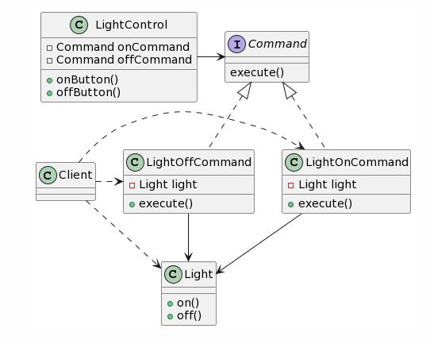

# 策略模式

## 定义

独立出来一个算法家族，可以是不同的计算方式，也可以是角色的不同行为。这些算法可以相互替换。

## 使用场景

1. 一个系统有很多类，它们的区别仅在于他们的行为不同，那么就可以使用策略模式动态地从多种行为中选择一个；
2. 一个系统需要动态地在几种算法中选择一种；

## 实现


```java
```


# 观察者模式

## 定义

一个对象被多个对象依赖，当一个对象改变状态时，它的依赖者会收到通知，并自动更新。

## 使用场景

1. 一个对象的改变会导致其他一个或多个对象的改变；
2. 一个对象在改变状态后需要通知其他对象；
3. 需要在系统中创建一个触发链，A影响B，B影响C......；

## 实现


# 装饰者模式

## 定义

提供了装饰类，用来包装原有的类，能够动态地给原有对象增加额外的功能。

- `装饰者` 和 `被装饰者` 的对象有着同样的超类；
- `装饰者` 在委托 `被装饰者` 之后可以添加自己的行为，完成剩余的工作；
- 可以使用任意数量的装饰者动态地装饰对象；

## 使用场景

1. 需要给一个类增加新的责任，但是不想或不能修改底层类；

## 实现

Java I/O的实现：


# 简单工厂模式

## 实现

简单工厂并不是一种设计模式，更多的是一种编程习惯。


```java
public interface Shape {
    String getDescription();
}

public class Circle implements Shape {
    @Override
    public String getDescription() {
        return "Circle";
    }
}

public class Rectangle implements Shape {
    @Override
    public String getDescription() {
        return "Rectangle";
    }
}

public class Square implements Shape {
    @Override
    public String getDescription() {
        return "Square";
    }
}
```


```java
public class SimpleShapeFactory {
    public Shape createShape(String type) {
        Shape shape = null;
        if ("Circle".equalsIgnoreCase(type)) {
            shape = new Circle();
        } else if ("Rectangle".equalsIgnoreCase(type)) {
            shape = new Rectangle();
        } else if ("Square".equalsIgnoreCase(type)) {
            shape = new Square();
        }
        return shape;
    }
}

public class SimpleShapeFactoryDemo {

    public static void main(String[] args) {
        System.out.println(
                new SimpleShapeFactory().createShape("Circle").getDescription()
        );
    }
}
```

## 与静态工厂的比较

使用静态工厂，不再需要创建工厂对象来实例化对象。但是缺点是不能通过子类化来改变创建方法的行为。

# 工厂方法模式

## 定义

定义了一个创建对象的接口，但是让子类决定要实例化哪个产品类。把类的实例化推迟到子类中进行。

对于每一个具体的创建者（如IPhoneFactory），通常有一整套的产品（如IPhone12、IPhone13）可以创建。

## 实现


```java
// 产品类（部分）
public interface Phone {
    void make();
}

public class IPhone12 implements Phone {
    @Override
    public void make() {
        System.out.println("making iPhone12...");
    }
}

public class IPhone13 implements Phone {
    @Override
    public void make() {
        System.out.println("making iPhone13...");
    }
}
```


```java
// 创造者类（部分）
public abstract class PhoneFactory {
    private Phone phone;

    public f void make(String type) {
        phone = createInstance(type);
        phone.make();
    }

    protected abstract Phone createInstance(String type);
}

public class IPhoneFactory extends PhoneFactory {
    @Override
    protected Phone createInstance(String type) {
        Phone phone = null;
        if ("iPhone12".equalsIgnoreCase(type)) {
            phone = new IPhone12();
        } else if ("iPhone13".equalsIgnoreCase(type)) {
            phone = new IPhone13();
        }
        return phone;
    }
}
```


```java
public class PhoneFactoryDemo {
    public static void main(String[] args) {
        PhoneFactory phoneFactory = new IPhoneFactory();
        phoneFactory.make("iPhone12");
    }
}
```

## 与简单工厂的区别

子类看起来和简单工厂相似；但是简单工厂更像是对创建对象的一种封装，而抽象工厂是提供了一个工厂框架，让子类来决定使用哪种实现，提供了对工厂方法的弹性。

# 抽象工厂模式

## 定义

提供了一个接口来创建相关或依赖对象的家族，而不需要指定具体类。

## 实现


## 比较工厂方法和抽象工厂

1. 工厂方法是通过继承来实现，让子类决定创建的具体类型；而抽象工厂是通过对象组合来实现，将一组相关的产品集结起来；
2. 使用工厂方法只是创建**一个产品**，抽象工厂可以创建**整个产品家族**；
3. 抽象工厂中经常使用抽象方法来创建具体的产品；

# 单例模式

## 定义

单例模式确保一个类只有一个实例，并提供一个全局的访问点。

## 实现

```java
/**
 * 懒汉式单例，使用 “双重检查加锁” 机制
 */
public class singleton1 {
    // volatile 关键词保证：当 signleton 被实例化后，其它线程能够立即获取到新值，而不是工作内存中的旧值。
    private volatile static singleton1 signleton = null;
    private static Object lock = new Object();

    private singleton1() {}

    public static singleton1 getInstance() {
        if (signleton == null) { //双重锁定
            synchronized (lock) {
                if (signleton == null) {
                    signleton = new singleton1();
                }
            }
        }

        return signleton;
    }
}
```


```java
/**
 * 饿汉式单例
 */
public final class singleton2 {
    private static final singleton2 instance = new singleton2();

    private singleton2() {}

    public static singleton2 getInstance() {
        return instance;
    }
}
```

```java
// 枚举单例 
public enum Singleton {
    UNIQUE_INSTANCE;
}

public class SingletonClient {
    public static void main() {
        Singleton singletion = Singleton.UNIQUE_INSTANCE;        
    }
}
```

# 命令模式

## 定义

命令模式是把请求封装为对象，以便用不同的请求、队列或者日志请求来参数化其他对象，并支持可撤销。

## 实现

以智能家居为例，手机上的 App 能够控制多个智能设备，但是这些设备可能来自不同的厂家，其中的方法也会是各式各样，无法统一（下图中的 Light 类）。我们可以把对该设备的请求命令封装为对象（LightOnCommand、LightOffCommand 类），并在需要时参数化 LightControl 类，来控制灯。



```java
interface Command {
    execute();
}

class LightOnCommand implements Command {
    private Light light;
    public LightOnCommand(Light light) {
        this.light = light;
    }
    
    public execute() {
        light.on();
    }
}

class LightOffCommand implements Command {
    private Light light;
    public LightOffCommand(Light light) {
        this.light = light;
    }
    
    public execute() {
        light.off();
    }
}
```


```java
class LightControl {
    private Command onCommand;
    private Command offCommand;
    
    public LightControl(Command onCommand, Command offCommand) {
        this.onCommand = onCommand;
        this.offCommand = offCommand;
    }
    
    public onButton() {
        onCommand.execute();
    }
    
    public offButton() {
        offCommand.execute();
    }
}
```


 ```java
 class Client {
     public static void main() {
         Light light = new Light();
         
         Command lightOnCommand = new LightOnCommand(light);
         Command lightOffCommand = new LightOffCommand(light);
                 
         LightControl lightControl = new LightControl(lightOnCommand, lightOffCommand);
         
         lightControl.onButton();
         lightControl.offButton();
     }
 }
 ```

## 扩展一：撤销操作


## 扩展二：自动化

大多数智能家居中都提供了自动化的功能，也就是根据场景批量执行命令，例如当用户回家后，打开灯、打开空调、关闭窗帘等。

```java
class BackHomeModel {
    List<Command> commands = new ArrayList<>();
    public BackHomeModel() {
        
    }
    
    public void addCommand(Command command) {
        commands.add(command);
    }
    
    public void action() {
        for(Command command : commands) {
            command.execute();
        }
    }
}
```


```java
class Client {
    public static void main() {
        Light light = new Light();
        
        Command lightOnCommand = new LightOnCommand(light);
        Command airConditionerOnCommand = new AirConditionerOnCommand(airConditioner);
        Command curtainOffCommand = new CurtainOffCommand(curtain);
        
                
        BackHomeModel backHomeModel = new BackHomeModel();
        backHomeModel.addCommand(lightOnCommand);
        backHomeModel.addCommand(airConditionerOnCommand);
        backHomeModel.addCommand(curtainOffCommand);
        
        backHomeModel.action();
    }
}
```


## 扩展三：请求队列


## 扩展四：日志请求


# 设计模式的原则

## 依赖倒置原则

- 依赖抽象，而不依赖具体类。

高层的组件不应该依赖于低层的组件，应该依赖于抽象。

以简单工厂为例，如果没有 SimpleShapeFactory，那么SimpleShapeFactoryDemo就直接依赖于Circle、Square、Rectangle。虽然已经有 Shape 类，但是它并没有带来什么好处。例如：

```java
public class SimpleShapeFactoryDemo {

    public static void main(String[] args) {
        String type = "Circle";
        Shape shape = null;
        if ("Circle".equalsIgnoreCase(type)) {
            shape = new Circle();
        } else if ("Rectangle".equalsIgnoreCase(type)) {
            shape = new Rectangle();
        } else if ("Square".equalsIgnoreCase(type)) {
            shape = new Square();
        }
        
       	if (shape != null) {
            System.out.println(shape.getDescription());
        }
    }
}
```


但是在应用简单工厂后，高层组件（SimpleShapeFactoryDemo）和低层组件（Circle、Square、Rectangle）都只依赖于抽象（Shape）。如果只从该例子看，工厂类SimpleShapeFactory 仍然依赖了低层组件（Circle、Square、Rectangle），但是如果使用工厂类的多了，在后续发生变化时，只需要改工厂类即可。
